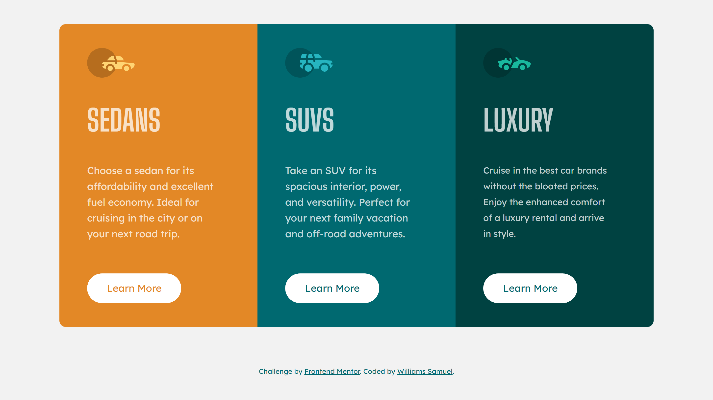
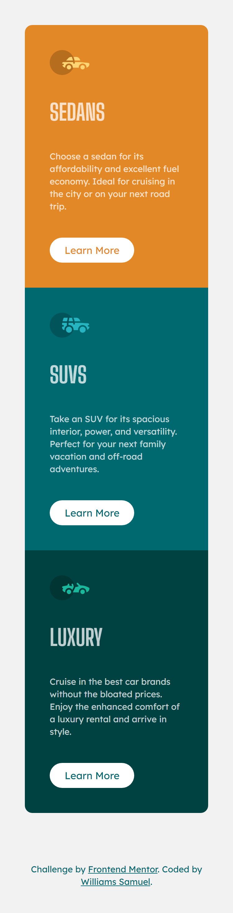

# Frontend Mentor - 3-column preview card component solution

This is a solution to the [3-column preview card component challenge on Frontend Mentor](https://www.frontendmentor.io/challenges/3column-preview-card-component-pH92eAR2-). Frontend Mentor challenges help you improve your coding skills by building realistic projects.

## Table of contents

- [Overview](#overview)
  - [The challenge](#the-challenge)
  - [Screenshot](#screenshot)
  - [Links](#links)
- [My process](#my-process)
  - [Built with](#built-with)
  - [What I learned](#what-i-learned)
  - [Continued development](#continued-development)
- [Author](#author)

## Overview

### The challenge

Users should be able to:

- View the optimal layout depending on their device's screen size
- See hover states for interactive elements

### Screenshot

### Links

- Solution URL: [3 Column Preview](https://www.frontendmentor.io/challenges/3column-preview-card-component-pH92eAR2-/hub/mobile-first-using-tailwind-css-DS7PIt1Z5)
- Live Site URL: [3 Column Preview](https://williamssam.github.io/3-column-preview)

## My process

### Built with

- Semantic HTML5 markup
- Tailwind CSS
- Flexbox

### What I learned

- Learnt how to extend tailwind components

### Continued development

Use more of Taiwind CSS in my projects and work on my hover, active, and focus state in tailwind css.

## Author

- Website - [Williams Samuel]
- Frontend Mentor - [@ysuperbreezy007](https://www.frontendmentor.io/profile/superbreezy007)
- Twitter - [@williams_codes](https://www.twitter.com/williams_codes)
